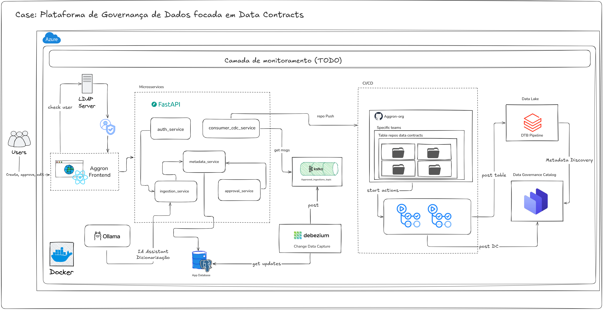

## Data Master: Aggron - plataforma E2E de governança de dados
By: Fabiana Andrade Barroso  
Trilha: Engenharia de Dados

Este case apresenta uma plataforma de dados para padronizar a criação e manutenção de tabelas no lake, cobrindo desde a modelagem inicial até a geração de contratos de dados, com aprovação e rastreabilidade.

A solução combina engenharia de software, engenharia de dados e ferramentas open-source para facilitar reprodutibilidade local.

## Objetivos da solução

- Oferecer uma interface única e governada para criação, edição e exclusão de tabelas no lake.
- Aplicar contrato de dados desde a criação da tabela.
- Viabilizar comunicação orientada a eventos após aprovação de ingestões.
- Centralizar metadados, histórico de versões e fluxo de aprovação.

## Desenho de Arquitetura



*Fun-fact*: o nome "Aggron" vem de um Pokémon.


## Visão geral dos componentes

### Frontend (`/frontend`)

SPA em React + TypeScript para abrir solicitações de ingestão, acompanhar histórico e executar ações de aprovação.

- Build/dev: Vite
- Rotas: `react-router-dom`
- Estado remoto: `@tanstack/react-query`
- UI: Tailwind + shadcn/ui


### Autenticação e autorização (`/auth_service` + `/ldap`)

- O `auth_service` autentica usuários contra LDAP e emite JWT.
- As siglas e owners são definidos no LDAP (`ldap/50-bootstrap.ldif`).
- Usuários só conseguem operar dentro das siglas às quais pertencem.


### Camada de microserviços

- `ingestion_service`: middleware principal para submissão, edição, deleção, consulta e análise de impacto.
- `metadata_service`: persistência e versionamento de metadados (PostgreSQL).
- `approval_service`: fluxo de aprovação/rejeição por owner.
- `auth_service`: login LDAP + JWT.

### Processamento orientado a eventos (CDC)

- PostgreSQL com tabela `outbox` (`postgres_db.session.sql`).
- Debezium/Kafka Connect publica eventos no Kafka.
- `cdc_consumer` consome eventos aprovados e gera/atualiza `datacontract.yaml` em repositórios no GitHub via API.

### Observabilidade

- Métricas Prometheus em todos os serviços FastAPI.
- Dashboards Grafana em `/monitoring/grafana/dashboards`.
- Stack adicional de observabilidade e carga em `docker-compose.observability.yml`.

## Fluxo funcional E2E

1. Usuário autentica no `auth_service` (LDAP + JWT).
2. Usuário cria solicitação no frontend (`/ingestion/submit`).
3. `ingestion_service` delega persistência ao `metadata_service`.
4. Owner aprova/rejeita no `approval_service`.
5. Em aprovação, o status e os dados enriquecidos seguem para outbox/CDC.
6. `cdc_consumer` gera ou atualiza data contract no GitHub.

## Tópicos típicos de engenharia de dados cobertos pelo pipeline

- Ingestão governada com workflow de aprovação por owner.
- Modelagem e versionamento de metadados de tabela e colunas.
- Classificação de dados (PII) e regras de qualidade.
- CDC com Debezium + Kafka (outbox pattern).
- Geração e atualização de Data Contract orientada a eventos.
- Controle de acesso por sigla (LDAP/JWT).
- Observabilidade operacional (Prometheus/Grafana) e teste de carga com Locust.

## Tecnologias utilizadas

- **Backend**: FastAPI, Uvicorn, psycopg2, httpx, PyJWT, ldap3
- **Frontend**: React 18, TypeScript, Vite, Tailwind CSS
- **Dados e mensageria**: PostgreSQL, Kafka, Zookeeper, Debezium/Kafka Connect
- **Governança/contratos**: Data Contract Manager + geração YAML no `cdc_consumer`
- **Infra local**: Docker Compose
- **Observabilidade**: Prometheus, Grafana, exporters, cAdvisor

## Organização do repositório

```text
.
├── README.md
├── docker-compose.yaml
├── docker-compose.observability.yml
├── postgres_db.session.sql
├── auth_service/
├── ingestion_service/
├── metadata_service/
├── approval_service/
├── cdc_consumer/
├── frontend/
├── kafka/
├── ldap/
├── monitoring/
└── load_test/
```

## Como executar localmente

### Pré-requisitos

- Docker e Docker Compose

### Subir stack principal

```bash
docker compose -f docker-compose.yaml up -d
```

Serviços publicados localmente:

- Frontend: `http://localhost:3000`
- Auth Service: `http://localhost:8000`
- Ingestion Service: `http://localhost:8001`
- Metadata Service: `http://localhost:8002`
- Approval Service: `http://localhost:8003`
- Kafka UI: `http://localhost:8080`
- Data Contract Manager: `http://localhost:8081`
- Kafka Connect: `http://localhost:8083`

### Subir observabilidade + carga (opcional)

```bash
docker compose -f docker-compose.yaml -f docker-compose.observability.yml up -d
```

- Prometheus: `http://localhost:9090`
- Grafana: `http://localhost:3001`
- Locust: `http://localhost:8089`

## Configuração

As principais variáveis podem ser sobrescritas por ambiente no `docker-compose.yaml`.

- `POSTGRES_USER`, `POSTGRES_PASSWORD`, `POSTGRES_DB`
- `JWT_SECRET`, `LDAP_ADMIN_PASSWORD`
- `METADATA_SERVICE_URL`, `AUTH_SERVICE_URL`
- `DATA_CONTRACT_MANAGER_URL`, `DATA_CONTRACT_MANAGER_HOST`, `DATA_CONTRACT_API_KEY`
- `GITHUB_TOKEN`, `GITHUB_ORG`
- `OLLAMA_URL`, `OLLAMA_MODEL`

## Exemplos de uso

### Login

```bash
curl -X POST http://localhost:8000/auth/login \
  -H "Content-Type: application/json" \
  -d '{"username":"jsilva","password":"senha123"}'
```

### Health checks

```bash
curl http://localhost:8000/health
curl http://localhost:8001/health
curl http://localhost:8002/health
curl http://localhost:8003/health
```

## Limitações e próximos passos observáveis no repositório

- A integração GitHub do `cdc_consumer` depende de `GITHUB_TOKEN` válido.
- Sugestões de dicionário por IA dependem de um serviço Ollama disponível.
- O README do frontend tem detalhes adicionais de execução local (`README_frontend.md`).
- Há espaço para ampliar testes automatizados entre serviços (o frontend já possui base com Vitest).
