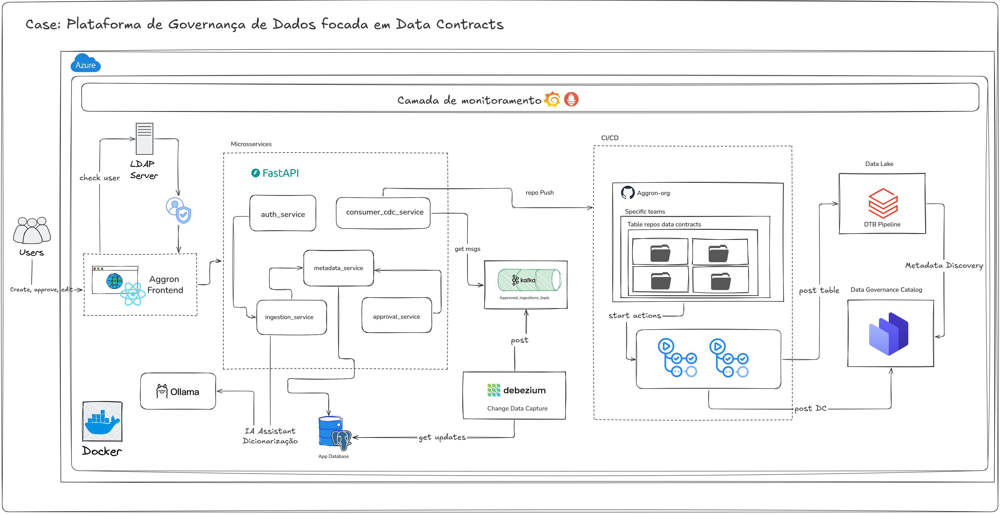
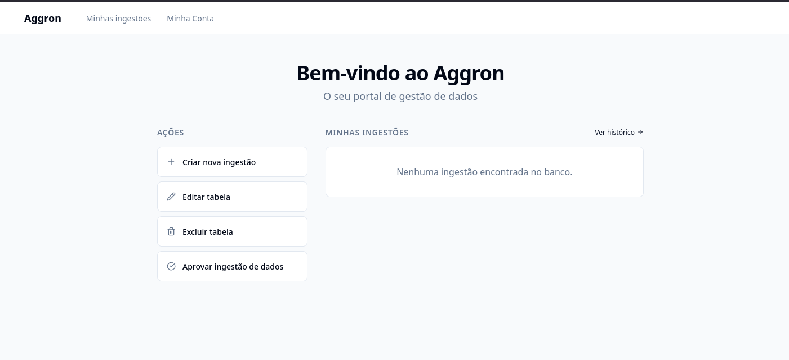
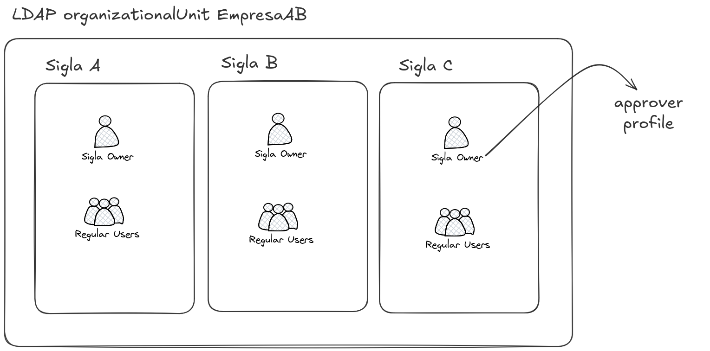
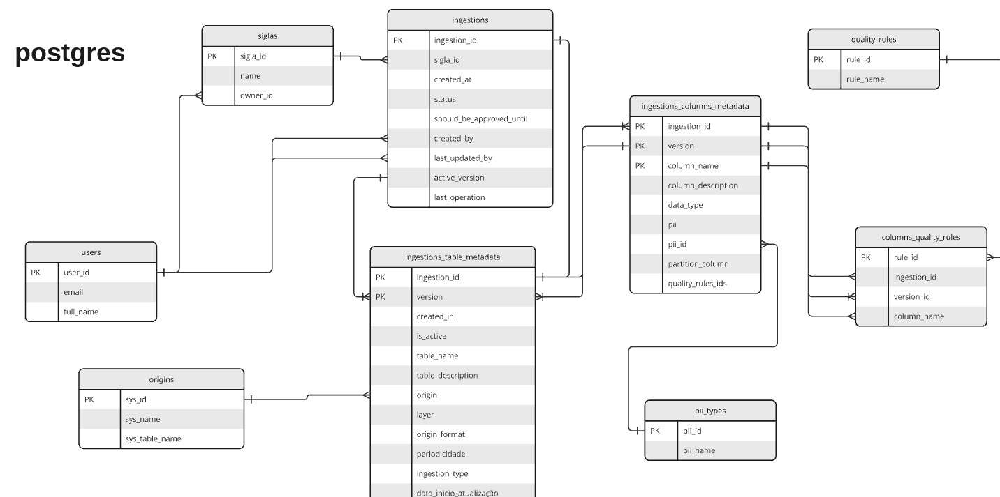
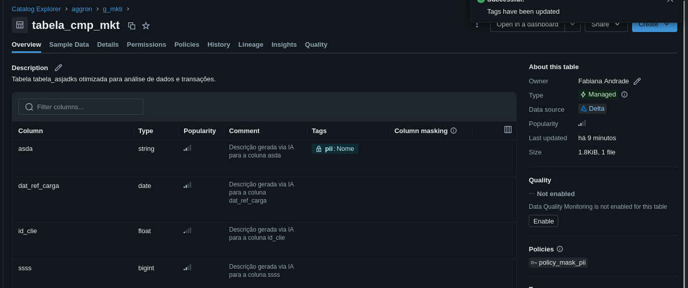
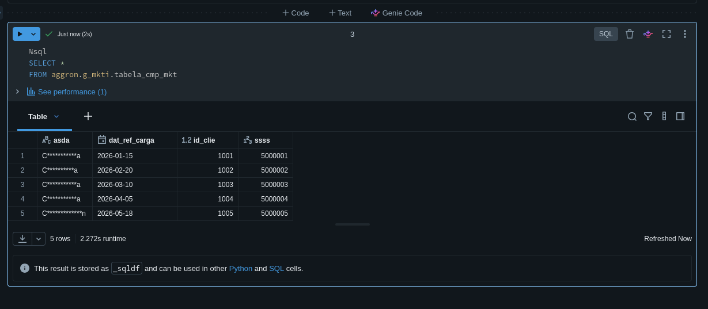

## Data Master: Aggron - plataforma E2E de governança de dados
By: Fabiana Andrade Barroso

Trilha: Engenharia de Dados

Esse case tem como objetivo apresentar uma plataforma de dados capaz de oferecer integração completa abrangendo o primeiro momento de modelagem e dicionarização da tabela, concepção de contratos de dados, criação do metadado no lake e integração com catálogo de governança.

A solução foi desenvolvida com conhecimentos interdiciplinares de engenharia de sofware, engenharia de dados e computação em nuvem. Além disso, priorizou-se a utlização de ferramentas open-source, de modo que facilitasse a reprodutibilidade. 


## Objetivos com a solução:

Na organização observo oportunidades que podem melhor a jornada do usuário, entre elas:
- Oferecer uma interface única e governada para criação e edição de tabelas no lake;
- Aplicar contrato de dados para todas tabelas do ambiente, de modo que cada base tenha SLAs bem definidos desde sua criação.
- Consumidores dos dados serem notificados em caso de alteração em tabela consumida
- 

# Desenho de Arquitetura


*Fun-fact*: O nome "Aggron" vem de um pokémon. Ele foi escolhido para representar a plataforma depois de muitas tentativas de escolher um nome legal...


### **Explicação dos Componentes**: ###
#### **Frontend** ####

A solução oferece uma interface responsável por permitir que usuários criem, editem e deletem tabelas do data lake. Por meio de uma interface amigável, que tanto o usuário de negócio, quanto engenheiros, podem utilizar, o usuário pode submeter suas solicitações. 

Todas as solicitações passam por um processo de aprovação, dessa forma, o owner da sigla/technical lead precisa aprovar a implantação. Após aprovação, a implementação segue de forma automática.


A implementação foi realizada com React 18 (SPA) e TypeScript, utilizando Vite 5 como servidor de desenvolvimento e ferramenta de build.

A navegação é feita com react-router-dom e o gerenciamento de estado de dados remotos com @tanstack/react-query.

O frontend consome APIs REST do backend via fetch, com URLs configuradas por variáveis de ambiente (`VITE_AUTH_SERVICE_URL`, `VITE_INGESTION_SERVICE_URL`, `VITE_APPROVAL_SERVICE_URL`).

A autenticação é baseada em JWT, com rotas protegidas no frontend e sessão persistida no navegador.



#### **LDAP Server** ###
A autenticação na plataforma é gerenciada a partir de um servidor LDAP.
No LDAP implementado, foi cadastrado previamente algumas siglas e usuários, assim sendo os usuários so conseguem abrir solicitações para tabelas da própria sigla, bem como os aprovadores (owners) das siglas são consumidos com base no que está cadastrado no LDAP.




#### **Camada de microserviços**
A plataforma é composta por microserviços especializados desenvolvidos em FastAPI (Python), garantindo escalabilidade e separação de responsabilidades:
- **Auth Service**: Gerencia a autenticação e integração com o servidor LDAP.
- **Ingestion Service**: Responsável pelo CRUD de solicitações de ingestão e a análise de impacto (**Impact Analysis**), mapeando a relação entre contratos de dados, produtos e consumidores.
- **Metadata Service**: Gerencia o estado e os metadados das tabelas e solicitações.
- **Approval Service**: Orquestra o fluxo de aprovações pelos owners de cada sigla.

#### **Banco de Dados (PostgreSQL)**
Toda a camada transacional da plataforma (solicitações de ingestão, aprovações e metadados) é persistida em um PostgreSQL com a replicação por WAL habilitada, condição necessária para o CDC com Debezium. O modelo relacional abaixo representa o esquema da `App Database`:



#### **Processamento Streaming e CDC**
Para garantir que as alterações de metadados sejam propagadas de forma assíncrona e resiliente, a solução utiliza a arquitetura de **Change Data Capture (CDC)**:
- **Debezium**: Captura alterações no banco de dados Postgres (WAL) em tempo real.
- **Kafka**: Atua como o backbone de eventos. É utilizado o padrão **Outbox**, onde eventos de ingestão aprovada são roteados para tópicos específicos.
- **CDC Consumer**: Um serviço especializado que consome esses eventos, transforma-os em um **Data Contract (YAML)** e automatiza a criação de repositórios e Pull Requests no GitHub via API.

#### **CI/CD e Integração com Databricks**
A implantação física da tabela ocorre via pipeline de CI/CD:
- **GitHub Actions**: O `cdc_consumer` dispara a criação de código em repositórios baseados em templates. A Action de CI valida o contrato de dados e executa a criação/alteração da tabela diretamente no **Databricks (Azure/Delta Lake)**.
- **Feedback Loop**: Ao finalizar a execução, a GitHub Action consome o endpoint de status do `ingestion_service` para reportar se a operação foi um **sucesso** ou **falha**, atualizando a interface para o usuário final.

#### Databricks Unity Catalog: mascaramento e rastreabilidade de dados sensíveis
Com base na classificação de dados **PII** definida no contrato de dados, foram criadas políticas de **Attribute-Based Access Control (ABAC)** no Unity Catalog do Databricks. Com essa configuração, os campos marcados como sensíveis passam a ser mascarados automaticamente no lake, reforçando a segurança da informação e a conformidade com a **LGPD**.

<p align="center">
  
</p>

Exemplo de consulta com dados mascarados:

<p align="center">
  
</p>


#### **Data Contract Manager (DCM)**
O **Data Contract Manager** atua como a plataforma de governança central da solução. 
- **Papel**: Ele serve como o catálogo oficial de contratos de dados, permitindo a definição de SLAs, esquemas e ownership.
- **Governança**: Baseado em conceitos de **Data Mesh**, o DCM organiza os dados em "Data Products" e "Ports", garantindo que a tabela criada no Databricks esteja alinhada a um contrato governado e versionado.

---

## 🛠️ Tópicos de Engenharia de Dados Cobertos
Este projeto serve como um case prático de implementação de diversas disciplinas de dados:
- **Data Governance**: Implementação de contratos de dados e catálogo de metadados.
- **CDC (Change Data Capture)**: Uso de Debezium e Kafka para sincronização de estado.
- **Event-Driven Architecture**: Fluxos assíncronos via tópicos Kafka.
- **Infrastructure as Code (IaC)**: Automação de tabelas via GitOps (GitHub Actions $\rightarrow$ Databricks).
- **Data Mesh**: Aplicação de conceitos de Data Products e domínios.
- **Observabilidade**: Monitoramento de infraestrutura e métricas de negócio.

---

## 🚀 Como Rodar Localmente

### Pré-requisitos
- Docker & Docker Compose
- Conta no GitHub (com Token de acesso para a API)
- Ollama instalado (para funcionalidades de LLM)

### Passos para Execução
1. **Configuração**: Crie um arquivo `.env` na raiz do projeto com as seguintes variáveis:
   - `POSTGRES_USER`, `POSTGRES_PASSWORD`
   - `LDAP_ADMIN_PASSWORD`, `JWT_SECRET`
   - `GITHUB_TOKEN`, `GITHUB_ORG`
   - `DATA_CONTRACT_MANAGER_URL`, `DATA_CONTRACT_MANAGER_API_KEY`
   - `KAFKA_BOOTSTRAP_SERVERS`, `OLLAMA_URL`, `OLLAMA_MODEL`

2. **Subir a Infraestrutura**:
   ```bash
   docker compose -f docker-compose.yaml -f docker-compose.observability.yml up -d
   ```

3. **Frontend**:
   ```bash
   cd frontend
   npm ci
   npm run dev
   ```
A plataforma estará disponível em `http://localhost:3000`.

### Nota sobre Infraestrutura de Nuvem
Para a validação do projeto em ambiente real, foi utilizada uma **Virtual Machine (VM) na Azure**. Optou-se por essa abordagem em vez de serviços gerenciados (PaaS) para reduzir os custos de manutenção na conta pessoal, mantendo a fidelidade do ambiente de execução.

---

## 📊 Monitoramento
A stack de observabilidade foi implementada para garantir a saúde dos microserviços e a visibilidade do fluxo de dados:

- **Prometheus**: Coleta métricas de performance (CPU, Memória, RPS, Latência) de todos os serviços FastAPI e exporters de infraestrutura (Node, Postgres, Kafka).
- **Grafana**: Visualização de dados através de dois dashboards principais:
  - **Infra Dashboard**: Monitora a saúde dos containers, consumo de recursos e erros de rede (4xx/5xx).
  - **Ingestions Dashboard**: Focado em métricas de negócio, como volume de ingestões por sigla, taxas de sucesso e distribuição de camadas do lake.
- **Blackbox Exporter**: Realiza probes de saúde externas para garantir que os endpoints críticos estejam online.
